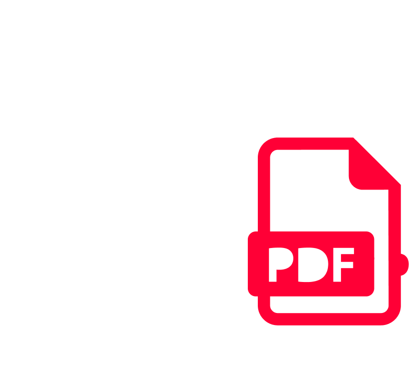
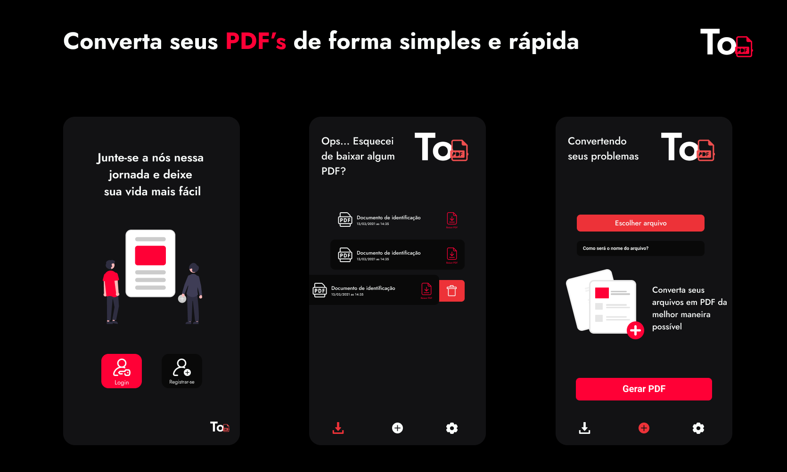

<h1 align="center">
    
</h1>

<p align="center">
  <a href="#-tecnologias">Tecnologias</a>&nbsp;&nbsp;&nbsp;|&nbsp;&nbsp;&nbsp;
  <a href="#-começando">Começando</a>&nbsp;&nbsp;&nbsp;|&nbsp;&nbsp;&nbsp;
  <a href="#-projeto">Projeto</a>&nbsp;&nbsp;&nbsp;|&nbsp;&nbsp;&nbsp;
  <a href="#-license">Licença</a>
</p>

<p align="center">
  
  
  

  
</p>
<br>

<p align="center">
  
</p>

---

## 🧪 Tecnologias

Este projeto foi desenvolvido utilizando as seguintes tecnologias:

- [React Native](https://reactnative.dev/)
- [Expo](https://expo.io/)
- [TypeScript](https://www.typescriptlang.org/)

## 🚀 Começando

Clone o projeto e acesse a pasta

```bash
$ git clone https://github.com/julioceno/app-topdf.git && cd app-topdf
```

Siga os passos abaixo

```bash
# Instale as dependências
$ yarn install

# Inicie o projeto
$ expo start
```

## 💻 Projeto

Aplicativo para converter seus arquivos para PDF 📄

Este é um projeto pessoal desenvolvido com o intuito de ampliar meus conhecimentos em react native.

## 📝 License

Este projeto está licenciado sob a Licença MIT. Veja o [LICENSE](LICENSE) para detalhes.

Feito com 🖤 por [Júlio Nepomuceno](https://github.com/julioceno) 👋
